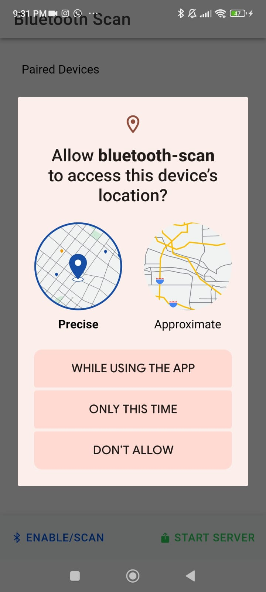
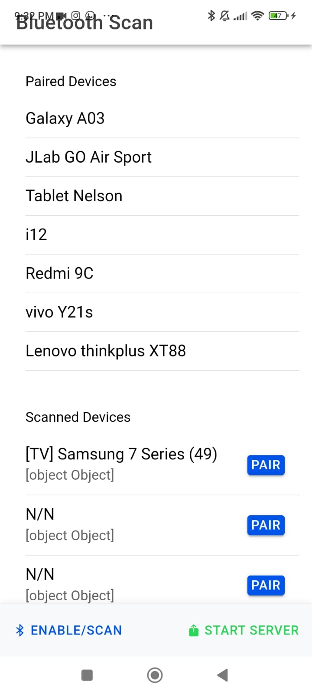
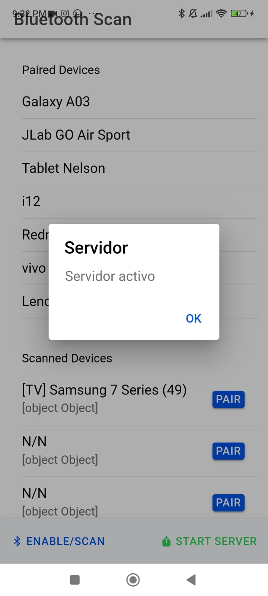

  

## 📲 APK
[APK](https://drive.google.com/file/d/1OyfXCCUU-4TumMyk5tFoCJltpmg4Van7/view?usp=sharing).

## 📷 Previews

   

## 🛠 Tech Stack & Open Source Libraries
- Minimum SDK level 32.
- 100% [Jetpack Compose](https://developer.android.com/jetpack/compose) based + [Coroutines](https://github.com/Kotlin/kotlinx.coroutines)
- Jetpack
 - Compose: Android’s modern toolkit for building native UI.
 - ViewModel: UI related data holder and lifecycle aware.
 - App Startup: Provides a straightforward, performant way to initialize components at application startup.
 
## 🏛️ Architecture

[Google's official architecture guidance](https://developer.android.com/topic/architecture).

[Google's official Bluetooth guidance](https://developer.android.com/reference/android/bluetooth/package-summary).

### UI Layer

The UI Layer consists of UI elements like buttons, menus, tabs that could interact with users and [ViewModel](https://www.jetbrains.com/help/kotlin-multiplatform-dev/compose-viewmodel.html) that holds app states and restores data when configuration changes.

