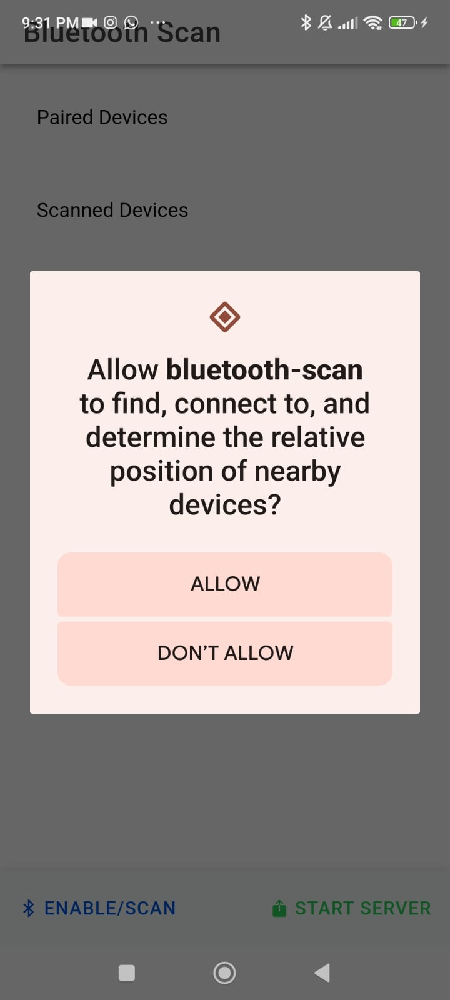

  

## 📲 APK
[APK](https://drive.google.com/file/d/1OyfXCCUU-4TumMyk5tFoCJltpmg4Van7/view?usp=sharing).

## 📷 Previews

   

## 🛠 Tech Stack & Open Source Libraries
- Minimum SDK level 32.
- Ionic Framework (v8+)
- Angular (v16+)
- Capacitor (v5+)
- Plugin Bluetooth LE (@capacitor-community/bluetooth-le)
 
 
## 🔧 Configutation

- Node.js (v18+)
- Ionic CLI (npm install -g @ionic/cli)
- Capacitor CLI (npm install -g @capacitor/cli)
- Android Studio IDE

